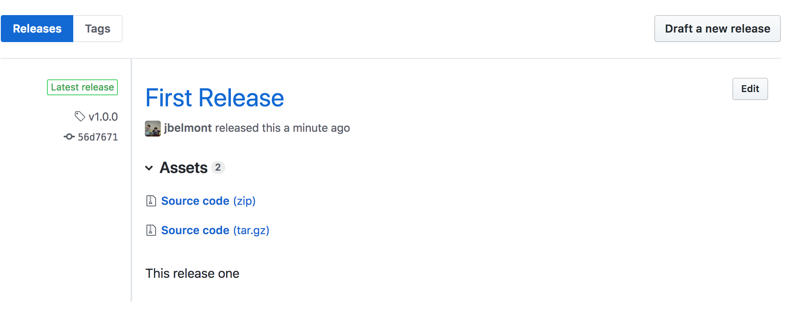

# Github Releaser

A Golang CLI Script that creates a Github Release from the Github API

```bash
POST /repos/:owner/:repo/releases
```

## Create a Github Release Documentation

[Github Releaser](https://developer.github.com/v3/repos/releases/#create-a-release)

#### Request Body

```json
{
  "tag_name": "v1.0.0",
  "target_commitish": "master",
  "name": "v1.0.0",
  "body": "Description of the release",
  "draft": false,
  "prerelease": false
}
```

#### Request Headers

| Request Header | Example |
| --- | --- |
| `Content-Type` | `Content-Type: "application/json"` |
| `Authorization` | `Authorization: "token someToken12345"` |

## Example CLI run to create a release

If you install this script and put your `GOPATH` in your `PATH` then you should be able to run the command like this:

```bash
github-releaser -tagName="v1.0.0" -targetCommitish=someCommit123445 -name="Your Release Name" -body="The body message" -username=jbelmont -repo=github-releaser
```

Else you will clone this repository and run the command like this:

```bash
go run main.go -tagName="v1.0.0" -targetCommitish=someCommit123445 -name="Your Release Name" -body="The body message" -username=jbelmont -repo=github-releaser -accessToken=$(echo $GITHUB_PERSONAL_ACCESS_TOKEN | tr -d '\n')
```

The access token here is stored in a PERSONAL Environment variable here and remove the newline here.

#### Grab your target commit in Command Line

You can run the following command to grab the commit on the top of your Git Log and copy to system clipboard:

```bash
git log --pretty=oneline | head -1 | awk '{print $1}' | pbcopy
```

#### Here is what the Github Release will look like

